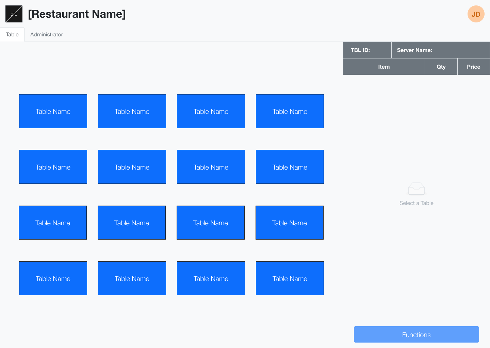

<a name="readme-top"></a>

<h1 align="center">ROMS Mk.2</h1>

<div align="center">
  
</div>

<div align="center">
        <h3>Table of Contents</h3>
        <p><a href="#about-the-project">About The Project</a></p>
        <p><a href="#getting-started">Getting Started</a></p>
        <p><a href="#license">License</a></p>
</div>

## About The Project

ROMS (Restaurant Operation Management Software) Mk.2 is an Electron based application built on React.

ROMS Mk.2 is developed primarily for assisting restaurant staff with daily activities, such as customer seating, table management, and bills. The software also supports viewing statistics relating to a restaurant's sales and performance. Included with the software is a training simulation to get employees used to the software, which is built with Unity.

### Built With

<p>
        
        
        
        
        
</p>

### Contributors

<table>
  <tr>
    <td align="center">
      <a href="https://www.github.com/mena1atwit">
        
        <br><strong>Alex Men</strong>
      </a>
    </td>
    <td align="center">
      <a href="https://www.github.com/faviercatwit">
        
        <br><strong>Corentin Favier</strong>
      </a>
    </td>
    <td align="center">
      <a href="https://www.github.com/wue1atwit">
        
        <br><strong>Ethan Wu</strong>
      </a>
    </td>
    <td align="center">
      <a href="https://www.github.com/brunok1atwit">
        
        <br><strong>Kris Bruno</strong>
      </a>
    </td>
    <td align="center">
      <a href="https://www.github.com/falconepatwit">
        
        <br><strong>Payton Falcone</strong>
      </a>
    </td>
  </tr>
</table>
<p align="right">(<a href="#readme-top">back to top</a>)</p>

## Getting Started

### Supported Platforms

ROMS Mk.2 currently supports the following platforms:

<div align="center">

| Platform  |                                             Supported                                             |                                                Coming Soon                                                 |
| --------- | :-----------------------------------------------------------------------------------------------: | :--------------------------------------------------------------------------------------------------------: |
| Windows   |  |                                                                                                            |
| MacOS     |                                                                                                   |        |
| GNU/Linux |                                                                                                   |  |

</div>

### Installation Guide:

1. Download the newest release version.
2. Unzip the downloaded .zip file into a secure directory.
3. Run the `romsmk2.exe` file located inside the unzipped directory.

### Building from Source Code:

1. Clone the repository
   ```sh
   git clone https://github.com/ROMS-Mk-2/ROMS.git
   ```
2. Install all the application's dependencies
   ```sh
   npm install
   ```
3. Build the application
   ```sh
   npm run build
   ```
4. Build the distributable
   ```sh
   npm run make
   ```
5. Navigate to `./out/make/zip` folder in your system file explorer and follow the path pertaining to the system you want to run the applicaton.
6. Unzip the file
7. Run the `romsmk2.exe` file

<p align="right">(<a href="#readme-top">back to top</a>)</p>

## License

Distributed under the MIT License. See [`LICENSE`](./LICENSE) for more information.

<p align="right">(<a href="#readme-top">back to top</a>)</p>
